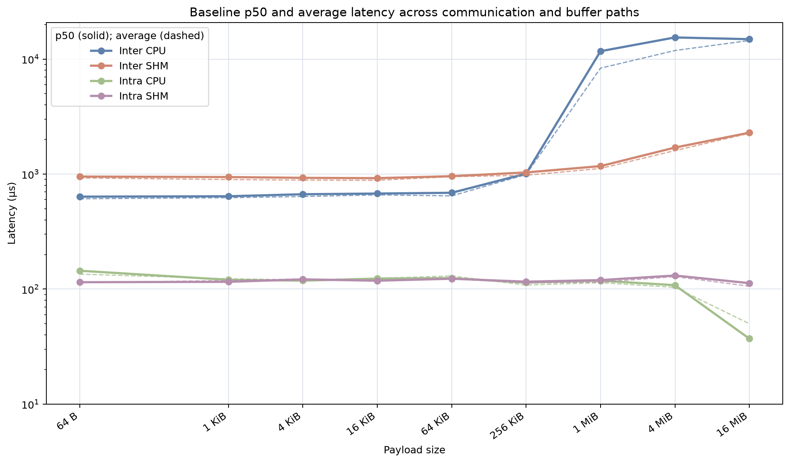
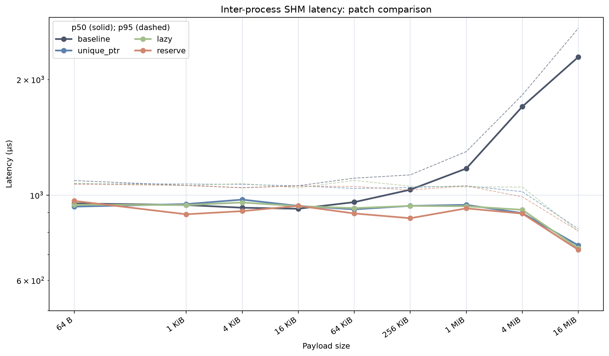
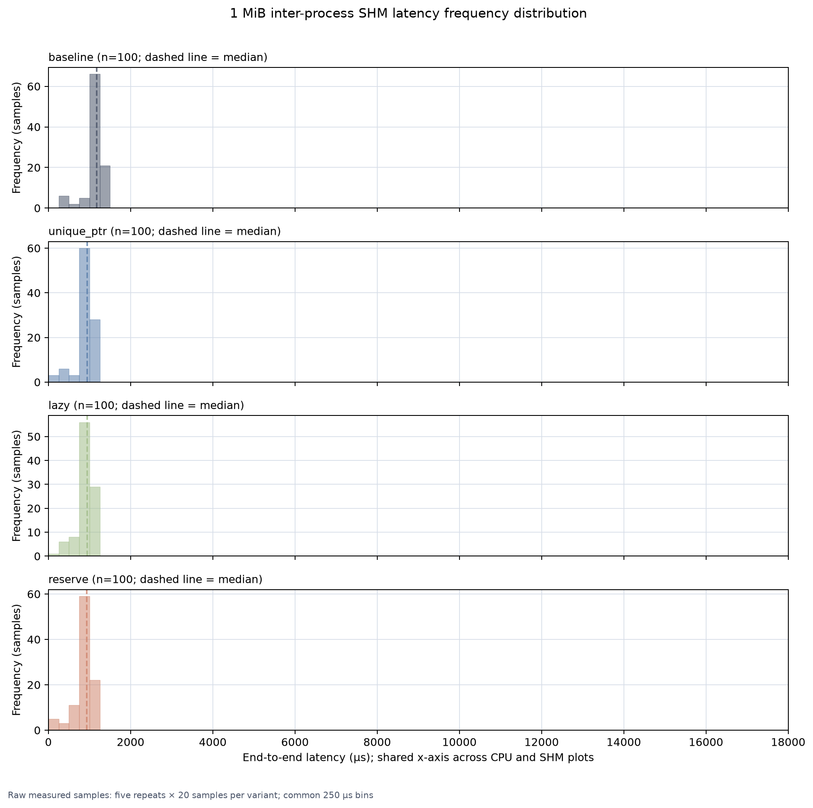
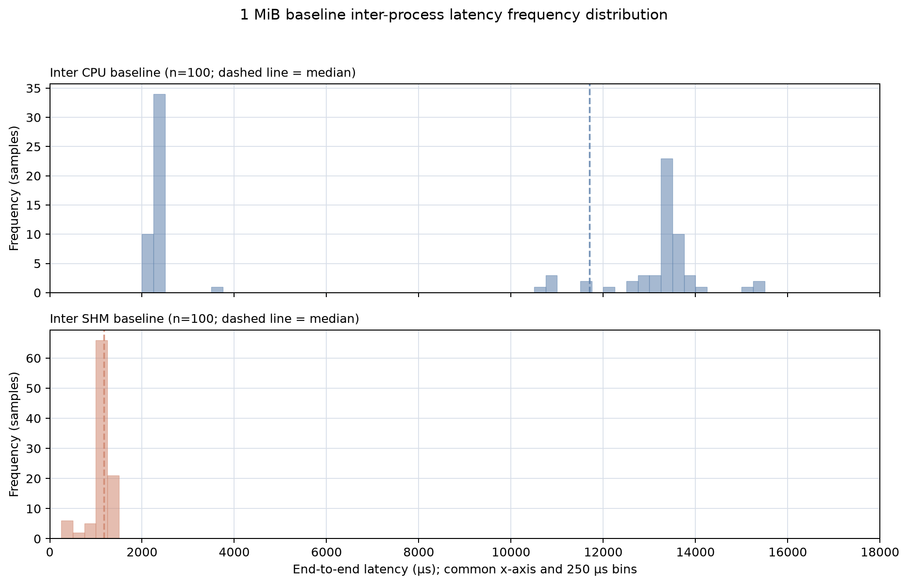

# 16-Way SHM Buffer Backend Benchmark Report

## Executive summary

This report uses the rerun in `benchmark-results-16way-rerun`, which
contains the four variants, nine payload sizes, four communication/backend
paths, and five repeats. Unlike the previous result set, this rerun also
contains the raw timing samples.

The main observations are:

- Inter-process CPU latency has a clear two-regime behavior at 1 MiB. The raw
  samples cluster near 2.3 ms and 13--14 ms, so a single aggregated p50 does
  not describe the behavior well.
- Inter-process SHM is slower than inter-process CPU for small payloads, but
  it avoids the large CPU-path latency regime. Baseline SHM p50 grows from
  1.17 ms at 1 MiB to 2.29 ms at 16 MiB.
- The three patches reduce the inter-process SHM p50 at 16 MiB to
  0.72--0.75 ms, a 67.7--68.5% reduction from baseline.
- The raw publish timing shows the same effect directly. At 1 MiB, SHM
  `publish()` p50 decreases from 672.6 µs for baseline to 410.1--423.4 µs
  for the patched variants.
- Intra-process latency is about 110--150 µs in this rerun. It is useful as a
  regression control, but it is not the target path for these patches.

## Measurement design

The matrix contains:

- 4 variants: baseline, `unique_ptr`, `lazy`, and `reserve`.
- 9 payload sizes: 64 B, 1 KiB, 4 KiB, 16 KiB, 64 KiB, 256 KiB, 1 MiB,
  4 MiB, and 16 MiB.
- 5 repeats per size/path combination.
- 30 messages per case at 10 Hz; 10 warm-up messages are excluded, leaving
  20 measured samples.
- 2 communication modes: `inter_process` and `intra_process_va`.
- 2 backends: `cpu` and `memfd` (called SHM below).

The summary contains 720 cases and the raw files contain 14,400 measured
sample rows. The summary table cells below are calculated directly from the 100
raw measured samples for each case (five repeats × 20 samples), in
microseconds, shown as `p50 / p95`. The percentile rank follows the benchmark
executable's lower-rank selection rule.
The 1 MiB histograms use the 100 raw e2e latency samples for each variant and
backend directly.

The benchmark records two independent timing quantities:

- `publish_duration_ns`: the interval around the publisher's `publish()`
  boundary. Allocation and payload initialization happen before this interval.
- `e2e_latency_ns`: the message timestamp to the subscriber's receive-side
  payload access.

## Baseline across all paths

| Payload | Inter CPU | Inter SHM | Intra CPU | Intra SHM |
|---:|---:|---:|---:|---:|
| 64 B | 636.3 / 726.9 | 951.4 / 1,091.2 | 144.5 / 179.9 | 114.8 / 173.8 |
| 1 KiB | 641.5 / 719.7 | 942.3 / 1,060.1 | 120.4 / 174.2 | 115.7 / 162.4 |
| 4 KiB | 667.8 / 753.0 | 927.2 / 1,045.0 | 118.4 / 166.0 | 121.5 / 169.3 |
| 16 KiB | 677.1 / 758.9 | 921.5 / 1,057.8 | 123.4 / 176.0 | 118.3 / 167.6 |
| 64 KiB | 687.6 / 776.9 | 958.8 / 1,107.0 | 124.6 / 174.8 | 123.1 / 168.2 |
| 256 KiB | 1,009.1 / 1,153.5 | 1,033.0 / 1,128.8 | 113.8 / 138.6 | 116.1 / 136.5 |
| 1 MiB | 11,700.0 / 13,774.4 | 1,172.9 / 1,298.2 | 118.4 / 128.7 | 119.8 / 132.9 |
| 4 MiB | 15,407.8 / 16,025.3 | 1,700.0 / 1,822.6 | 108.2 / 117.2 | 131.3 / 152.5 |
| 16 MiB | 14,879.5 / 16,019.0 | 2,289.5 / 2,718.5 | 37.1 / 78.9 | 112.7 / 127.5 |

The baseline plot shows that the CPU path enters a multi-millisecond regime at
1 MiB and above. SHM avoids that regime, but its latency is not constant: the
baseline SHM p50 increases from 1,172.9 µs at 1 MiB to 2,289.5 µs at 16 MiB.
This is an observed size-dependent cost on the end-to-end path; it should not
be interpreted as proof of a payload-sized copy on the SHM wire path.

### Inter-process SHM-specific fixed overhead

The Intra SHM result is an important control. It is close to Intra CPU, so the
local memfd buffer operations are not the main reason that small Inter SHM
messages are slower. In the intra-process path, the RMW descriptor path is
bypassed: the shared pointer can be delivered directly. In the inter-process
path, `create_descriptor_with_endpoint()` is used to prepare the memfd
descriptor, followed by descriptor serialization and the corresponding
`from_descriptor_with_endpoint()` processing on the subscriber side.

The following difference-in-differences estimates the residual SHM-specific
inter-process cost:

```text
(Inter SHM - Intra SHM) - (Inter CPU - Intra CPU)
```

| Payload | SHM inter-process difference | CPU inter-process difference | Residual SHM-specific difference |
|---:|---:|---:|---:|
| 64 B | 837 µs | 492 µs | 345 µs |
| 1 KiB | 827 µs | 521 µs | 306 µs |
| 4 KiB | 806 µs | 549 µs | 256 µs |
| 16 KiB | 803 µs | 554 µs | 250 µs |
| 64 KiB | 836 µs | 563 µs | 273 µs |

This leaves approximately 0.24--0.34 ms of fixed overhead for small
inter-process SHM messages. It is reasonable to attribute this residual to
the descriptor path introduced by `create_descriptor_with_endpoint()` and its
subscriber-side counterpart, including descriptor validation, cache lookup,
reader management, and descriptor serialization/deserialization. It should
not be interpreted as an `mmap()` on every message: the imported memfd mapping
is cached, and FD transfer plus `mmap()` occur only on a cache miss.

The publisher-side block lookup, IPC registration, UID assignment, and
descriptor construction are inter-process SHM path operations; they are not
performed by the intra-process shared-pointer path. At larger payloads, the
CPU path's serialization and receive-side costs dominate this fixed SHM
descriptor overhead.



The same four-path p50 and average view is also available for each patched
variant. Solid lines are p50 values calculated from all 100 raw samples for
each size/path case; dashed lines are the arithmetic average of those samples.
The average is included because the inter-process CPU path is clearly bimodal.

- [`unique_ptr`](./figures/unique_ptr-path-latency.png)
- [`lazy`](./figures/lazy-path-latency.png)
- [`reserve`](./figures/reserve-path-latency.png)

## Variant results across all paths

### `unique_ptr`

| Payload | Inter CPU | Inter SHM | Intra CPU | Intra SHM |
|---:|---:|---:|---:|---:|
| 64 B | 664.2 / 747.6 | 933.4 / 1,069.6 | 129.4 / 169.7 | 118.7 / 157.3 |
| 1 KiB | 653.2 / 743.5 | 947.7 / 1,069.2 | 123.7 / 173.4 | 118.8 / 169.5 |
| 4 KiB | 648.8 / 746.6 | 973.4 / 1,066.2 | 118.4 / 174.1 | 122.8 / 166.4 |
| 16 KiB | 706.6 / 789.1 | 937.4 / 1,057.2 | 120.7 / 174.8 | 116.4 / 154.4 |
| 64 KiB | 691.2 / 779.7 | 918.4 / 1,040.9 | 137.3 / 171.9 | 120.6 / 170.1 |
| 256 KiB | 1,015.7 / 1,143.6 | 937.6 / 1,046.8 | 114.4 / 140.0 | 117.9 / 129.1 |
| 1 MiB | 11,528.3 / 13,607.7 | 943.2 / 1,057.1 | 115.7 / 128.2 | 120.4 / 134.8 |
| 4 MiB | 13,639.7 / 14,052.2 | 897.6 / 1,021.2 | 112.7 / 137.1 | 133.8 / 158.3 |
| 16 MiB | 13,363.8 / 15,714.3 | 739.8 / 816.6 | 41.0 / 79.3 | 115.0 / 127.5 |

### `lazy`

| Payload | Inter CPU | Inter SHM | Intra CPU | Intra SHM |
|---:|---:|---:|---:|---:|
| 64 B | 680.1 / 754.4 | 944.0 / 1,073.8 | 120.7 / 174.7 | 118.2 / 160.4 |
| 1 KiB | 633.8 / 741.7 | 942.1 / 1,059.1 | 121.1 / 171.6 | 116.1 / 151.6 |
| 4 KiB | 666.1 / 752.3 | 956.8 / 1,071.7 | 115.9 / 169.6 | 118.5 / 167.1 |
| 16 KiB | 701.8 / 792.3 | 936.0 / 1,044.9 | 153.8 / 190.3 | 116.7 / 150.6 |
| 64 KiB | 682.0 / 786.6 | 925.1 / 1,091.9 | 115.3 / 177.4 | 114.2 / 139.0 |
| 256 KiB | 1,076.0 / 1,139.8 | 937.4 / 1,054.9 | 114.6 / 136.5 | 117.1 / 129.8 |
| 1 MiB | 13,005.8 / 13,638.0 | 935.6 / 1,050.5 | 117.3 / 130.2 | 120.9 / 133.2 |
| 4 MiB | 15,374.4 / 16,209.4 | 915.6 / 1,049.2 | 113.4 / 140.0 | 133.7 / 155.0 |
| 16 MiB | 14,786.7 / 15,270.8 | 727.6 / 805.7 | 41.6 / 79.6 | 113.3 / 124.8 |

### `reserve`

| Payload | Inter CPU | Inter SHM | Intra CPU | Intra SHM |
|---:|---:|---:|---:|---:|
| 64 B | 640.2 / 727.0 | 966.0 / 1,067.9 | 137.7 / 184.4 | 113.0 / 155.1 |
| 1 KiB | 647.7 / 745.7 | 891.5 / 1,059.7 | 134.2 / 171.5 | 115.8 / 153.7 |
| 4 KiB | 644.4 / 747.9 | 908.5 / 1,046.0 | 130.9 / 171.6 | 116.3 / 153.8 |
| 16 KiB | 716.7 / 791.7 | 937.8 / 1,056.0 | 134.9 / 180.1 | 115.6 / 165.3 |
| 64 KiB | 668.3 / 740.4 | 895.9 / 1,053.1 | 118.3 / 166.3 | 116.1 / 152.6 |
| 256 KiB | 1,047.2 / 1,164.0 | 870.7 / 1,030.6 | 115.0 / 157.7 | 115.5 / 127.0 |
| 1 MiB | 13,139.5 / 13,585.6 | 923.7 / 1,056.9 | 114.8 / 128.9 | 119.7 / 137.4 |
| 4 MiB | 13,655.4 / 13,967.0 | 895.1 / 989.8 | 106.7 / 131.3 | 133.0 / 153.5 |
| 16 MiB | 13,282.3 / 13,502.3 | 720.3 / 806.3 | 69.0 / 78.8 | 115.7 / 129.2 |

The CPU regression-control results do not show a consistent patch effect. The
SHM results do: at 16 MiB, all three patches reduce p50 by about two thirds.
The geometric-mean p50 ratios versus baseline are:

| Variant | Inter CPU | Inter SHM | Intra CPU | Intra SHM |
|---|---:|---:|---:|---:|
| `unique_ptr` | 0.983× | 0.794× | 1.013× | 1.011× |
| `lazy` | 1.027× | 0.793× | 1.012× | 0.996× |
| `reserve` | 0.992× | 0.773× | 1.091× | 0.988× |




## 1 MiB raw latency distributions

The following figures are histograms of the 100 raw e2e latency samples for
each variant: five repeats with 20 measured samples per repeat. The bins are
250 µs wide and both figures use the same 0--18,000 µs x-axis. Dashed lines
show the raw-sample median.


The CPU histogram makes the two regimes visible. Most samples are around
2.3--2.5 ms or 13--14 ms, with the relative frequency varying by variant.
This is why the 1 MiB p50 is not a reliable description of one fixed latency
mode. The p95 remains in the slower regime for every variant.



The SHM histogram is concentrated around 0.8--1.3 ms. The baseline is shifted
to the right, while the patched variants overlap around 0.9--1.0 ms.

For a direct baseline-only comparison, the two inter-process paths are shown
together below with the same bins and x-axis. Dashed lines indicate the raw
sample median (p50).



### 1 MiB publish-side timing

The raw publish timing supports the interpretation that the patch changes work
inside the publisher path, not merely subscriber scheduling:

| Backend / metric | Baseline | `unique_ptr` | `lazy` | `reserve` |
|---|---:|---:|---:|---:|
| CPU `publish()` p50 / p95 | 1,589.3 / 1,801.1 µs | 1,507.6 / 1,740.2 µs | 1,499.0 / 1,731.8 µs | 1,497.3 / 1,756.1 µs |
| SHM `publish()` p50 / p95 | 672.6 / 754.7 µs | 423.4 / 477.4 µs | 421.5 / 474.4 µs | 410.1 / 476.4 µs |
| SHM e2e p50 / p95 | 1,172.9 / 1,298.2 µs | 943.2 / 1,057.1 µs | 935.6 / 1,050.5 µs | 923.7 / 1,056.9 µs |

This does not yet identify every allocation or serialization operation that
causes the baseline cost. It does show that the reduction is already visible
around `publish()`, and that the e2e improvement follows the same direction.

The publish-only raw distributions are shown below. These use the same
four-row layout and common 100 µs bins; their x-axis is shared between CPU and
SHM and spans 0--4,000 µs.


## Limitations and interpretation

The SHM path is not demonstrated to be strictly constant-time with respect to
payload size. The safe conclusion is narrower: the patch removes most of the
observed large-buffer growth in this benchmark. The remaining end-to-end
latency includes DDS discovery, executor scheduling, queueing, and process
startup effects.

The 1 MiB histograms are raw e2e samples, but the tables still use the
benchmark's percentile calculation. With 20 samples per repeat, p95 and p99
use the same order statistic, so they should not be treated as independent
tail metrics. The raw CSV files should be preferred for future distribution
analysis.

## Reproduction and data

The rerun summary files are:

- [baseline.csv](./benchmark-results-16way-rerun/baseline.csv)
- [unique_ptr.csv](./benchmark-results-16way-rerun/unique_ptr.csv)
- [lazy.csv](./benchmark-results-16way-rerun/lazy.csv)
- [reserve.csv](./benchmark-results-16way-rerun/reserve.csv)

The raw files are in
[`./benchmark-results-16way-rerun/raw/`](./benchmark-results-16way-rerun/raw/).

Figures can be regenerated from the rerun with the workspace virtual
environment:

```bash
source .venv/bin/activate
python tools/plot_benchmark_report.py \
  --data-dir benchmark-results-16way-rerun
```

The 16-way rerun itself is orchestrated with:

```bash
source ~/ros2_lyrical/install/setup.bash
source install/setup.bash
ros2 run memfd_buffer_backend_benchmark run_16way_benchmark.py \
  --output-dir benchmark-results-16way-rerun \
  --overwrite
```
