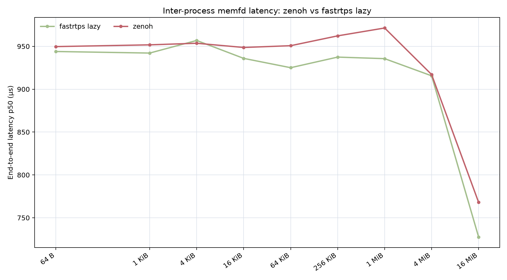
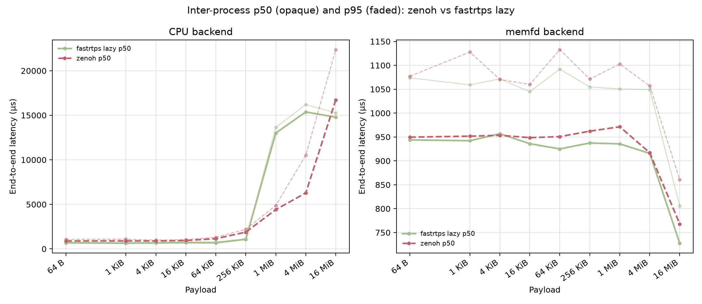
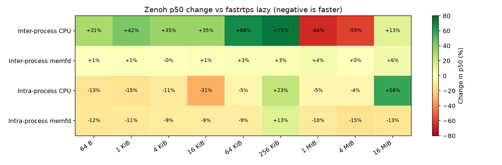
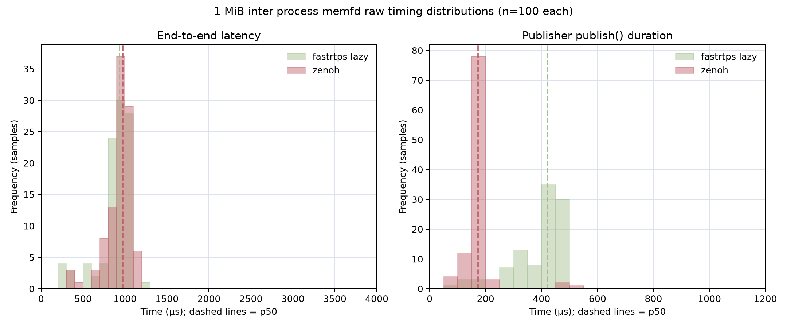

# Zenoh vs fastrtps lazy memfd rosidl buffer benchmark report

## Executive summary

This report compares the unmodified `rmw_zenoh_cpp` path with the
`rmw_fastrtps_cpp` `lazy` implementation. The lazy implementation is the
fastrtps behavior expected to be merged upstream, so it is the sole fastrtps
reference for this comparison. No fastrtps patch was applied to the zenoh run.

The main results are:

- Inter-process memfd p50 is close across all payloads: zenoh is within +0.6%
  to +5.6% of fastrtps lazy, with a geometric-mean difference of only +1.9%.
  At 16 MiB, zenoh measures 768.0 µs versus 727.6 µs for fastrtps lazy.
- At 1 MiB, zenoh memfd end-to-end p50 is 971.4 µs versus 935.6 µs for
  fastrtps lazy (+3.8%). The p95 values are 1,102.7 µs and 1,050.5 µs.
- Zenoh's inter-process CPU path is slower at small payloads (+31.1% p50 at
  64 B), but is 66.1% lower at 1 MiB and 59.1% lower at 4 MiB. At 16 MiB it
  is 13.1% higher, so this CPU result is not uniformly better.
- At 1 MiB, zenoh reduces memfd publisher `publish()` p50 by 58.8% versus
  fastrtps lazy (173.4 µs versus 421.5 µs), but the end-to-end path is nearly
  tied because it includes transport and subscriber-side work.

The practical conclusion is that zenoh and the expected upstream fastrtps
lazy implementation provide very similar inter-process memfd end-to-end
latency. Zenoh has a distinct CPU-path profile: higher small-message overhead,
but much lower CPU-path latency at 1--4 MiB.



## Measurement design

The zenoh matrix contains one implementation:

- RMW: `rmw_zenoh_cpp`
- Zenoh router: local `rmw_zenohd`, default configuration
- Fastrtps reference: `lazy` raw data from the existing 16-way rerun
- Payloads: 64 B, 1 KiB, 4 KiB, 16 KiB, 64 KiB, 256 KiB, 1 MiB, 4 MiB,
  and 16 MiB
- Communication: `inter_process` and `intra_process_va`
- Buffer modes: CPU and memfd
- Repeats: 5
- Messages per case: 30 at 10 Hz
- Warm-up: first 10 messages excluded; 20 measured samples remain
- Affinity: publisher CPU 8, subscriber CPU 9, intra-process CPU 8
- Discovery wait: 3 seconds before each inter-process publisher

The fastrtps lazy and zenoh measurements use the same protocol: 9 sizes × 2
communication modes × 2 backends × 5 repeats. The zenoh run generated 180
summary rows and 3,600 measured raw samples. Every case received all 30
messages, collected 20 measured samples, and every intra-process case reported
30/30 virtual-address matches.

The benchmark records two timings:

- `publish_duration_ns`: time spent inside the publisher's `publish()` call
  boundary. Payload allocation and initialization happen before this timing.
- `e2e_latency_ns`: publisher timestamp to subscriber-side payload access.

All reported percentiles use the benchmark's lower-rank order-statistic rule;
the p50 and p95 tables below are calculated over 100 raw samples (five
repeats × 20 measured messages) per case.

## Inter-process memfd results

Values are microseconds, shown as `p50 / p95`.

| Payload | fastrtps lazy | zenoh | Zenoh p50 change |
|---:|---:|---:|---:|
| 64 B | 944.0 / 1,073.8 | 949.7 / 1,077.0 | +0.6% |
| 1 KiB | 942.1 / 1,059.1 | 951.7 / 1,127.9 | +1.0% |
| 4 KiB | 956.8 / 1,071.7 | 953.6 / 1,070.5 | -0.3% |
| 16 KiB | 936.0 / 1,044.9 | 948.7 / 1,060.0 | +1.4% |
| 64 KiB | 925.1 / 1,091.9 | 950.7 / 1,132.9 | +2.8% |
| 256 KiB | 937.4 / 1,054.9 | 962.2 / 1,071.4 | +2.6% |
| 1 MiB | 935.6 / 1,050.5 | 971.4 / 1,102.7 | +3.8% |
| 4 MiB | 915.6 / 1,049.2 | 917.1 / 1,057.0 | +0.2% |
| 16 MiB | 727.6 / 805.7 | 768.0 / 860.5 | +5.6% |


The memfd curves are close at every size. The largest measured difference is
at 16 MiB, where zenoh is 40.4 µs slower at p50; this is small compared with
the multi-millisecond variation seen in the CPU path.

## CPU and memfd path comparison

The paired figure shows p50 as opaque lines and p95 as faded lines for zenoh
and fastrtps lazy.



At selected payload sizes, the inter-process CPU and memfd results are:

| Payload / backend | fastrtps lazy p50 / p95 (µs) | zenoh p50 / p95 (µs) | Zenoh p50 change |
|---|---:|---:|---:|
| 64 B CPU | 680.1 / 754.4 | 891.4 / 1,072.3 | +31.1% |
| 64 B memfd | 944.0 / 1,073.8 | 949.7 / 1,077.0 | +0.6% |
| 1 MiB CPU | 13,005.8 / 13,638.0 | 4,412.8 / 4,877.5 | -66.1% |
| 1 MiB memfd | 935.6 / 1,050.5 | 971.4 / 1,102.7 | +3.8% |
| 4 MiB CPU | 15,374.4 / 16,209.4 | 6,280.9 / 10,524.6 | -59.1% |
| 4 MiB memfd | 915.6 / 1,049.2 | 917.1 / 1,057.0 | +0.2% |
| 16 MiB CPU | 14,786.7 / 15,270.8 | 16,721.3 / 22,369.4 | +13.1% |
| 16 MiB memfd | 727.6 / 805.7 | 768.0 / 860.5 | +5.6% |

The geometric-mean zenoh/fastrtps-lazy p50 ratios across all nine sizes are
1.050× for inter-process CPU (+5.0%), 1.019× for inter-process memfd (+1.9%),
0.971× for intra-process CPU (-2.9%), and 0.914× for intra-process memfd
(-8.6%).



## Publisher-side timing at 1 MiB

| Backend / metric | fastrtps lazy p50 / p95 (µs) | zenoh p50 / p95 (µs) | Zenoh p50 change |
|---|---:|---:|---:|
| CPU `publish()` | 1,499.0 / 1,731.8 | 3,094.9 / 3,414.9 | +106.5% |
| memfd `publish()` | 421.5 / 474.4 | 173.4 / 200.7 | -58.8% |
| CPU end-to-end | 13,005.8 / 13,638.0 | 4,412.8 / 4,877.5 | -66.1% |
| memfd end-to-end | 935.6 / 1,050.5 | 971.4 / 1,102.7 | +3.8% |



The raw distributions show that zenoh's memfd publisher timing is shifted
substantially left of fastrtps lazy. The end-to-end distributions are closer,
because they also include transport scheduling, queueing, and subscriber-side
work.

## Reproduction

Build the benchmark package after sourcing the Lyrical ROS 2 underlay:

```bash
cd ~/workspace/ros2_ws
source ~/ros2_lyrical/install/setup.bash
colcon build --packages-select memfd_buffer_backend_benchmark \
  --cmake-args -DCMAKE_BUILD_TYPE=Release
source install/setup.bash
```

Start a local router and run the zenoh matrix:

```bash
source ~/ros2_lyrical/install/setup.bash
source install/setup.bash
ros2 run rmw_zenoh_cpp rmw_zenohd > /tmp/memfd-zenoh-router.log 2>&1 &
python3 src/memfd_buffer_backend_benchmark/memfd_buffer_backend_benchmark/scripts/run_e2e_benchmark.py \
  --rmw-implementation rmw_zenoh_cpp \
  --variant zenoh \
  --sizes 64,1024,4096,16384,65536,262144,1048576,4194304,16777216 \
  --count 30 --rate-hz 10 --warmup 10 --repeats 5 --seed 20260812 \
  --publisher-affinity 8 --subscriber-affinity 9 --intra-affinity 8 \
  --discovery-wait 3 \
  --communications inter_process,intra_process_va --modes cpu,memfd \
  --output src/memfd_buffer_backend_benchmark/benchmark-results-zenoh/zenoh.csv \
  --raw-output src/memfd_buffer_backend_benchmark/benchmark-results-zenoh/raw/zenoh.csv
```

Generate the lazy-only comparison figures with the workspace virtual
environment:

```bash
source .venv/bin/activate
cd src/memfd_buffer_backend_benchmark
python3 tools/plot_zenoh_comparison.py \
  --data-dir benchmark-results-zenoh \
  --fastrtps-dir benchmark-results-16way-rerun \
  --output-dir figures/zenoh-comparison
```

## Limitations

The lazy fastrtps and zenoh datasets were collected as separate benchmark
runs, not simultaneously. They use the same host, CPU affinities, benchmark
binary and matrix parameters, but normal run-to-run scheduling and system
noise can remain. The result therefore supports a measured comparison under
controlled conditions, not a hardware-independent transport ranking.

The local router is part of the zenoh inter-process path. Its presence and
default configuration are intentional and should be kept for reproduction.
The benchmark does not isolate router CPU time or memory use.

The 20 samples per repeat are sufficient for the aggregate comparison, but
p95 and p99 are adjacent order statistics under the benchmark's percentile
rule. Raw CSVs should be used for detailed tail analysis.

Finally, `memfd` here refers to the rosidl buffer backend path. It is distinct
from enabling Zenoh's own transport-level shared-memory optimization.

## Data and tooling

- [zenoh summary CSV](benchmark-results-zenoh/zenoh.csv)
- [zenoh raw CSV](benchmark-results-zenoh/raw/zenoh.csv)
- [fastrtps lazy raw CSV](benchmark-results-16way-rerun/raw/lazy.csv)
- [comparison plotting script](tools/plot_zenoh_comparison.py)
